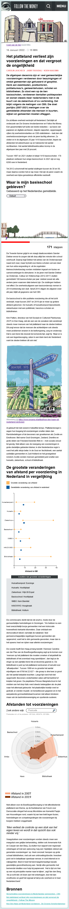

# ⚙ Follow the money design project

## 📂 Assignment
How can we visualize the impoverishment in the Netherlands for the readers of Follow The Money (in a narrative) way for mobile screens?

## 🧾 Table of contents
-   [About the project](##About-the-project)
      * [Built with](###Built-with)
-   [Packages/Dependecies](##Packages/dependecies)
      * [Dependecies](##Dependecies)
      * [Dev dependecies](##Dev-dependecies)
-   [License](##License)

## 📖 About the project
The project is about the impoverishment in the Netherlands, we are basically rebuilding an [article](https://www.ftm.nl/artikelen/verschraling-platteland?share=IRv4FP8SPRRDJmysxbzVmmmSMXMoT%2Ff5%2B0mXIgKyqDIQSq8iB%2F%2BMT5b9oBqtJH0%3D&utm_medium=social&utm_campaign=sharebuttonleden&utm_source=linkbutton) but more in a visual way to let readers understand the core of the problem, the current article is according to FTM too hard to understand, and they wanted to have it another way, the point of the article was not clear enough.

## 🛠 Built with
The article is built with [React.js](https://reactjs.org/d) and the charts are built with [D3.js](https://d3js.org/)

## 🧰 Packages/dependecies

### 🧱 Dependecies
- [React](https://reactjs.org/)
- [React-DOM](https://reactjs.org/docs/react-dom.html)
- [D3](https://d3js.org/)
### 🧱 Dev dependecies
- [React-Scripts](https://www.npmjs.com/package/react-scripts)
- [Web-vitals](https://www.npmjs.com/package/web-vitals)

## 📑 Sources
- [Notion](https://busy-flame-a4b.notion.site/Information-Design-Project-Follow-The-Money-Groep-2-caeef139141f4df2bccffa3c435ab2a3)

## 🔖 License

## 👪 Contributers
- [Carolin Jaschek]()
- [Jabir Tisoudali](https://github.com/jabirtisou)
- [Koen Haagsma](https://github.com/KoenHaagsma)
